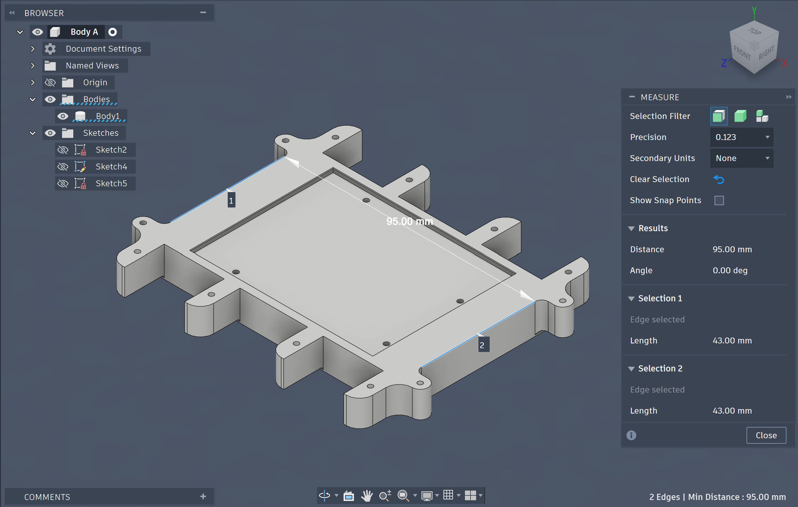
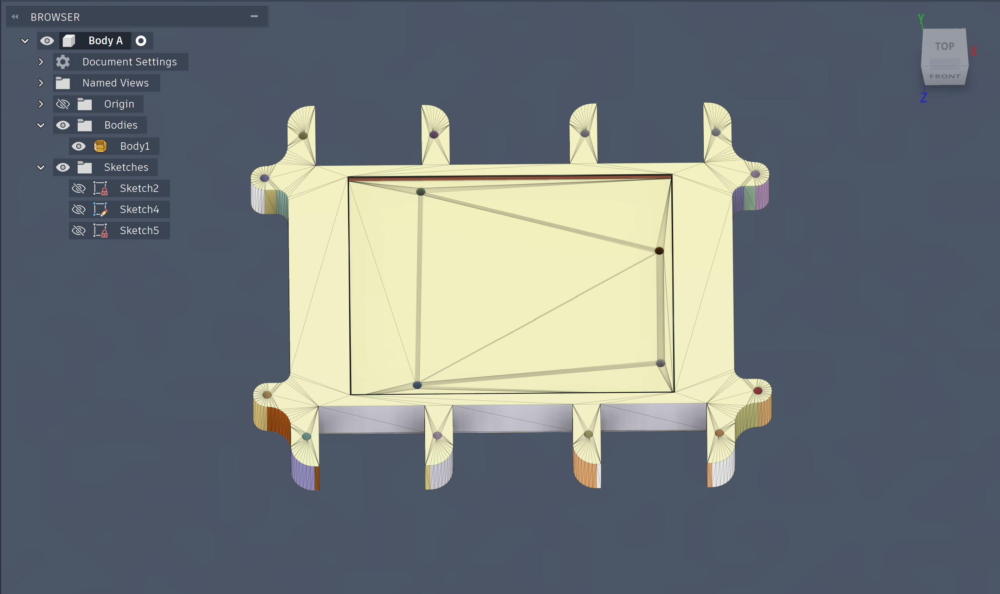
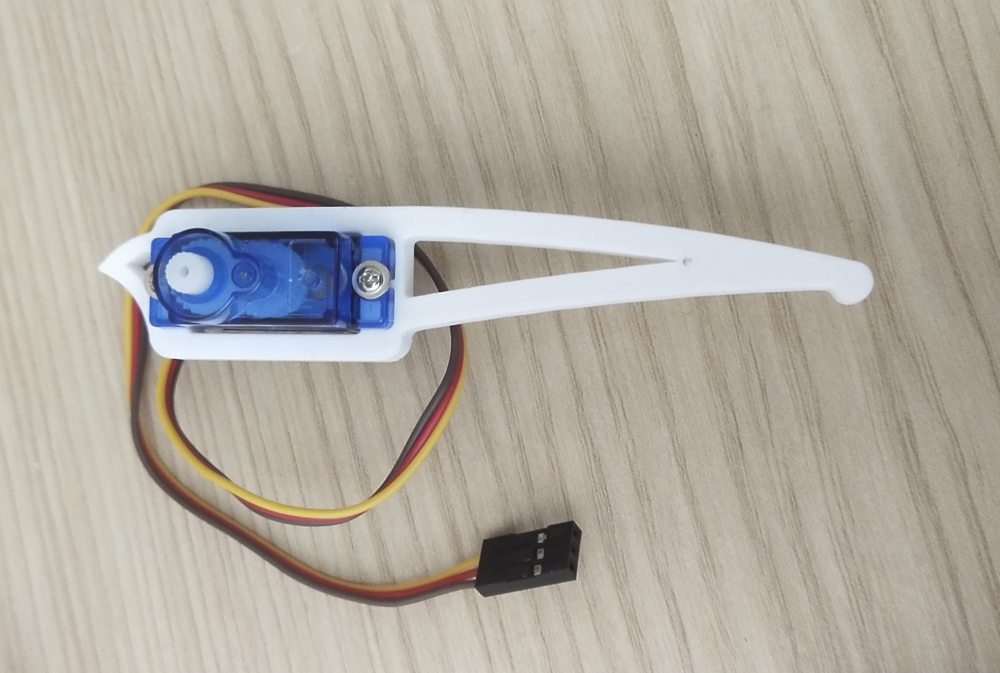
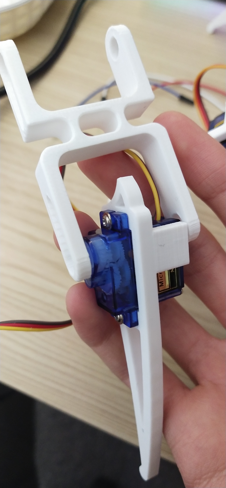
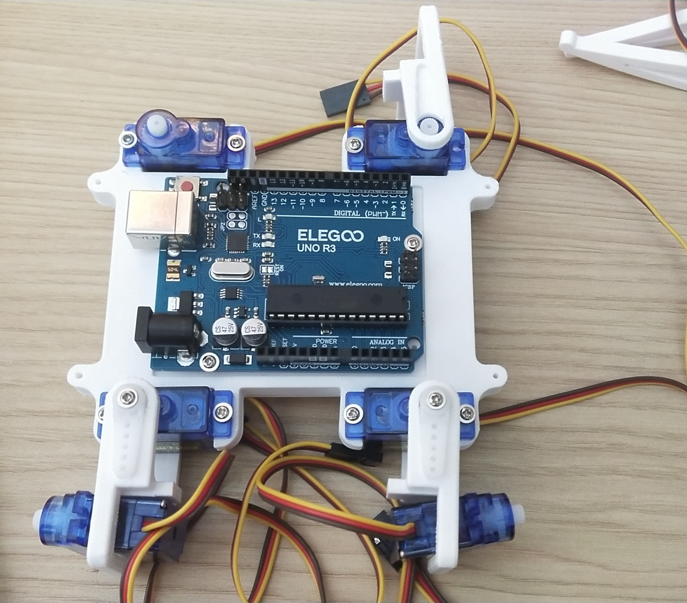

# ( Quick introduction )

By the way, this is my first project. Please "criticize" me if you have any suggestions. :)

  
   
  <em>POV: Debugging takes a lot of time...</em>

I just want to note that some of the 3D components I have used to make my projects actually came from this creator, (https://www.printables.com/model/272529-spider-robotquad-robot-quadruped-sg90-by-regishsu/files#preview.GQXLs). However, the main body part didn't fit my SG90 micro-servos' size, so I recreated it in Autodesk Fusion 360. If you want to view this body component *(.stl)*, just navigate to the **3D Models (Fusion)** folder that I created. 

One more thing is that I could use ESP-32 for this project, but I was considering to finish it as soon as possible in the easiest way. 

---

## ( Physical tools that I used for this project: Quadruple Robot )
- Microcontroller (Standard/Simple Arduino)
- 12 Micro-servos (SG90)
- PCA9685 driver 16-pin
- Jumper wires
- 5V power supply
- 9mm screws
- 3D printer (I'm using Creality)

## ( Digital tools )
- Arduino IDE (C++)
- ROS2 (Robot Operation System - Python)

---

## ( Pre-design on Autodesk Fusion )
Here is the body base that I created in Fusion: 

  
   
  <em>Body Base Design (NO MESH)</em>

  
   
  <em>Body Base Design (WITH MESH)</em>

This is what it looks like when each part is attached with SG90 micro-servos. 

  
   
  <em>Leg Components</em>

After attaching the "thigh" with the foot: 

  
   
  <em>Leg Component With Knee</em>

  
   
  <em>Main Body</em>

---

( 1 )
Firstly, I printed all the parts that I need for this project, which are the legs and body. Then, I screw four SG90 micro-servos onto the body component for the legs. Ensuring to stabilize them with 9mm screws, otherwise they would wobble when you test them with code. 

  
   
  <em>Main Body</em>

Additionally, I calibrated the angles of the micro-servos so the servo horns (or shafts) on each servo so they won't collide with the body part. 

I repeated the same process for each joint on the quadruple robot, and here is what it ends up... 

( 2 )

